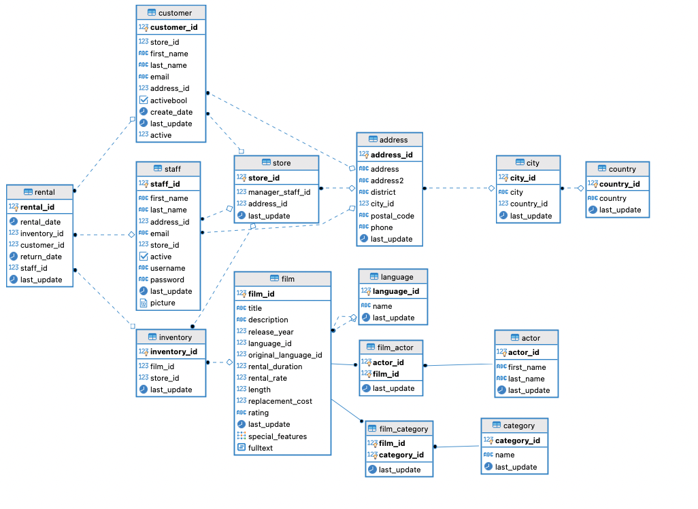

# Views demo




```
SELECT cu.customer_id as id, 
		   cu.first_name || ' ' || cu.last_name as full_name, 
		   a.address, 
		   a.postal_code  as zip_code, 
		   a.phone, 
		   ci.city,
		   co.country,
		   CASE
	            WHEN cu.activebool THEN 'active'::text
	            ELSE 'not active'::text
	        END AS notes
	FROM public.customer cu
	JOIN public.address a ON cu.address_id = a.address_id 
	JOIN public.city ci ON a.city_id = ci.city_id
	JOIN public.country co ON ci.country_id = co.country_id
	WHERE co.country = 'Mexico';
```

Turn into a view: 
```
CREATE VIEW public.customer_info_mx_view AS
	SELECT cu.customer_id as id, 
		   cu.first_name || ' ' || cu.last_name as full_name, 
		   a.address, 
		   a.postal_code  as zip_code, 
		   a.phone, 
		   ci.city,
		   co.country,
		   CASE
	            WHEN cu.activebool THEN 'active'::text
	            ELSE 'not active'::text
	        END AS notes
	FROM public.customer cu
	JOIN public.address a ON cu.address_id = a.address_id 
	JOIN public.city ci ON a.city_id = ci.city_id
	JOIN public.country co ON ci.country_id = co.country_id
	WHERE co.country = 'Mexico';
```

Turn into materialized view: 

```
CREATE MATERIALIZED VIEW public.customer_info_mx_materialized_view AS
    SELECT cu.customer_id as id, 
               cu.first_name || ' ' || cu.last_name as full_name, 
               a.address, 
               a.postal_code  as zip_code, 
               a.phone, 
               ci.city,
               co.country,
               CASE
                    WHEN cu.activebool THEN 'active'::text
                    ELSE 'not active'::text
                END AS notes
        FROM public.customer cu
        JOIN public.address a ON cu.address_id = a.address_id 
        JOIN public.city ci ON a.city_id = ci.city_id
        JOIN public.country co ON ci.country_id = co.country_id
        WHERE co.country = 'Mexico';
```

```
SELECT * FROM public.customer_info_mx_view;
```

```
SELECT * FROM customer_info_mx_materialized_view; 
```

```
INSERT INTO public.address VALUES (606, 'Puerta del Sol Nte 209', NULL, 'Veracruz', 125, '67905', '7755223364', '2022-09-10 09:45:30+00');
INSERT INTO public.customer VALUES (600, 1, 'ENRIQUE', 'GARCIA', 'ENRIQUE.GARCIA@sakilacustomer.org', 606, false, '2022-09-10', '2022-02-15 09:57:20+00', 0);
```


```
REFRESH MATERIALIZED view customer_info_mx_materialized_view; 
```

```
SELECT * FROM customer_info_mx_materialized_view; 
```


