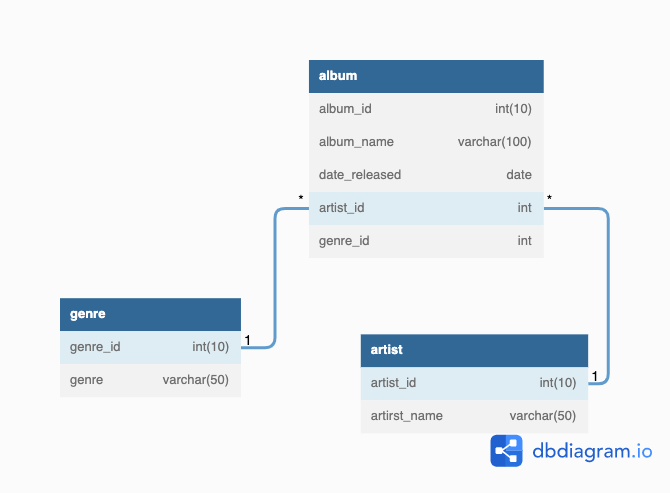

# Lab 2: SQL Statement Types [DDL & DML]

In this lab, your main goal is to create a music database within a docker container, create the table to hold information
regarding music albums, artists and their genre and manipulate the data within it. 

### Prerequisites
* [Install docker](https://docs.docker.com/engine/install/) 
* Install a db client (i.e. [DBeaver](https://dbeaver.io/download/)) 
* Install docker compose (only if you are on Linux)

### What You Will Learn
* Create and execute DDL statements (CREATE, ALTER).   To be implemented (TRUNCATE, DROP)
* Create and execute DML statements (SELECT, INSERT, UPDATE, DELETE). 
* Create and execute TCL commands.

## Let's get started

In this repository you will find a `docker-compose.yml` file with a MySQL database defined, you can also find the environment
variables file, please leverage it to start your container. 

1. Create a `music` database

2. Write the DDL commands to create the tables within the `movie` database using the following schema: 

3. Now let's insert some data into our tables according to the following information: 

**Genre**

| genre_id | album_name        |
|:--------:|:-----------------:|
| 1        | Alternative/Indie |
| 2        | Pop               |
| 3        | Alternative Rock  |
| 4        | Electronic        |
| 5        | Classical music   |
| 6        | Hip hop           |
| 7        | Metal             |
| 8        | Country           |
| 9        | Rhythm and blues  |
| 10       | Rap               |

**Artist**

| artist_id | artist            |
|-----------|-------------------|
| 1         | Maroon 5          |
| 2         | Metallica         |
| 3         | Cartel de Santa   |
| 4         | Harry Styles      |
| 5         | Steve Aoki        |
| 6         | The Beatles       |
| 7         | Twenty One Pilots |
| 8         | Blink-182         |
| 9         | The Weeknd        |
| 10        | Imagine Dragons   |
| 11        | Coldplay          |
| 12        | The Chainsmokers  |

**Albums**

| album_id | album_name                                | date_released | artist_id | genre_id |
|:--------:|:-----------------------------------------:|:-------------:|:---------:|:--------:|
| 1        | Overexposed                               | 2012-06-20    | 1         | 1        |
| 2        | Master of Puppets                         | 1986-03-03    | 4         | 7        |
| 3        | Volumen Prohibido                         | 2006-03-20    | 3         | 10       |
| 4        | Harry's House                             | 2022-05-20    | 4         | 2        |
| 5        | Wonderland                                | 2012-01-10    | 5         | 4        |
| 6        | Metallica                                 | 1991-08-12    | 2         | 7        |
| 7        | Abbey Road                                | 1969-09-26    | 6         | 9        |
| 8        | Help!                                     | 1965-08-06    | 6         | 9        |
| 9        | Sgt. Pepper's Lonely Hearts Club Band     | 1967-05-26    | 6         | 9        |
| 10       | Magical Mystery Tour                      | 1967-11-27    | 6         | 9        |
| 11       | Blurryface                                | 2015-05-17    | 7         | 3        |
| 12       | Twenty One Pilots                         | 2009-12-29    | 7         | 3        |
| 13       | Trench                                    | 2018-10-05    | 7         | 3        |
| 14       | Blink-182                                 | 2020-09-10    | 8         | 3        |
| 15       | Starboy                                   | 2016-11-25    | 9         | 4        |
| 16       | Sick Boy                                  | 2018-12-14    | 9         | 4        |
| 17       | So Far So Good                            | 2022-05-13    | 12        | 4        |
| 18       | Evolve                                    | 2017-06-23    | 10        | 1        |
| 19       | Night Visions                             | 2012-09-04    | 10        | 1        |
| 20       | Music of the Spheres                      | 2021-10-15    | 11        | 1        |
| 21       | Viva la Vida or Death and All His Friends | 2008-06-12    | 11        | 1        |

4. Get all the Harry Styles albums and their released year. 

5. Was Master of Puppets released by Harry Styles? I don't think so, let's update it with the correct artist that in 
this case is `Metallica`. Verify the album is not longer displayed under Harry Styles. 

6. Add a new column of a suitable data type named `has_awards` with a suitable default value. 

7. Update the value of the new column `has_awards` to reflect that the following albums have awards and verify it's reflected: 
    * Evolve
    * Trench
    * Blink-182

8. We made a mistake when inserting the released date for the `Blink-182` album, let's update that record with the actual 
date of `2003-10-18`.

9. Get all the albums that contain the letter `V` (case-insensitive) at the beginning (first letter) of their name.

10. Delete the `Classical music` record in the `genre` table. 

## Troubleshooting

