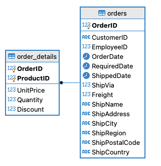
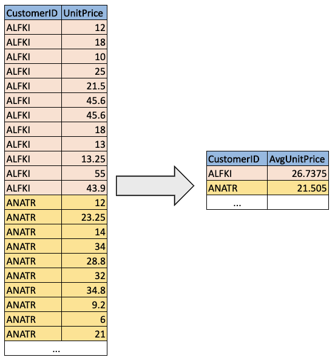
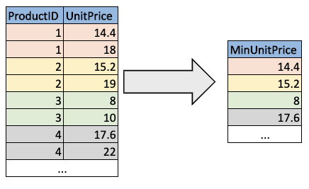

# Lab 5: Window Functions


### Prerequisites
* [Install docker](https://docs.docker.com/engine/install/) 
* Install a db client (i.e. [DBeaver](https://dbeaver.io/download/)) 
* Install docker compose (only if you are on Linux)

### What You Will Practice
- Window functions

# Let's get started

## Window functions syntax

The following is the generic syntax for a window function: 

```
SELECT <column1>,
       <column2>, 
       <window function>(expression) OVER (PARTITION BY <partition_list> ORDER BY <order_lits> ROWS frame_clause)
FROM <table_name>
```

* **window_function** is the name of the window function we want to use (sum, avg, row_number, etc...)
* **expression** is the name of the column that we want the window function to operate on; it may not be necessary depending on the **window_function** to use. 
* **OVER** this word means that is a window function
* **PARTITION BY** divides the rows into partitions, so we can specify which rows to use to compute the window function
* **partition_list** is the name of the column(s) we want to partition by
* **ORDER BY** is used to order the rows within each partition (optional).
* **order_list** is the name of the column(s) we want to order by
* **ROWS** can be used if we want to further limit the rows within our partition (optional).
* **frame_clause** defines how much offset from our current row we want our window size. 

The window functions are divided into three types value window functions, aggregation window functions, and ranking window functions:


In this lab we will be using the tables **orders** and **order_details** from the Northwind sample database adapted for MySQL. 



# Aggregate functions exercises

## Exercise 1

Create a column to calculate the average **Unit Price** for each existing customer.

Expected results: 


## Exercise 2
Create a new column that calculates the minimum **Unit Price** for each product id.

Expected results: 


## Exercise 3
Create a new column that calculates the average **Unit Price** for each group of **CustomerID** and **EmployeeID**.

Expected results: 


# Ranking functions exercises

## Exercise 4
Create a new column that ranks the Unit Price of products in descending order for each CustomerID using `ROW_NUMBER()`

Expected results: 


## Exercise 5: 
Create a new column that ranks the Unit Price of products in descending order for each CustomerID using `RANK()`

Expected results: 


## Exercise 6: 
Create a new column that ranks the Unit Price of products in descending order for each CustomerID using `DENSE_RANK()` 

Expected results: 


# Value functions exercises

## Exercise 7: 
