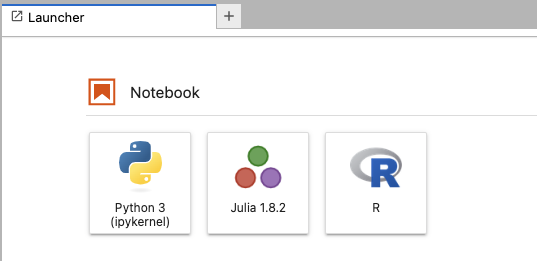
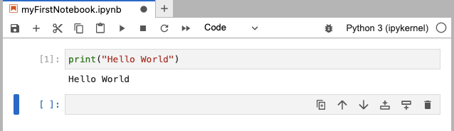
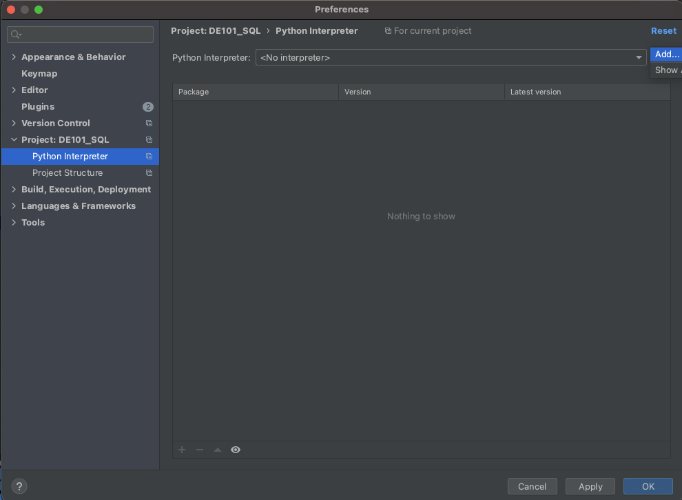
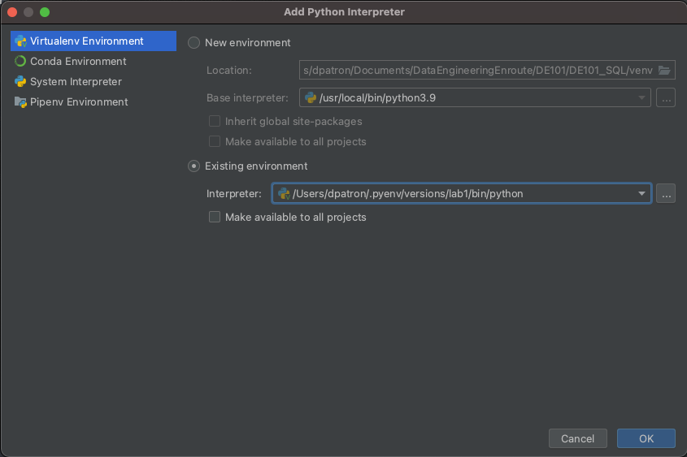
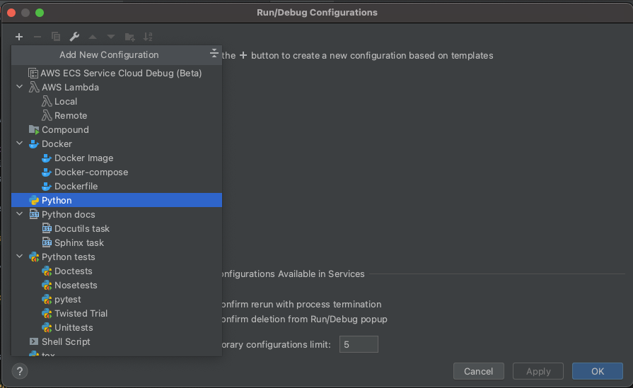
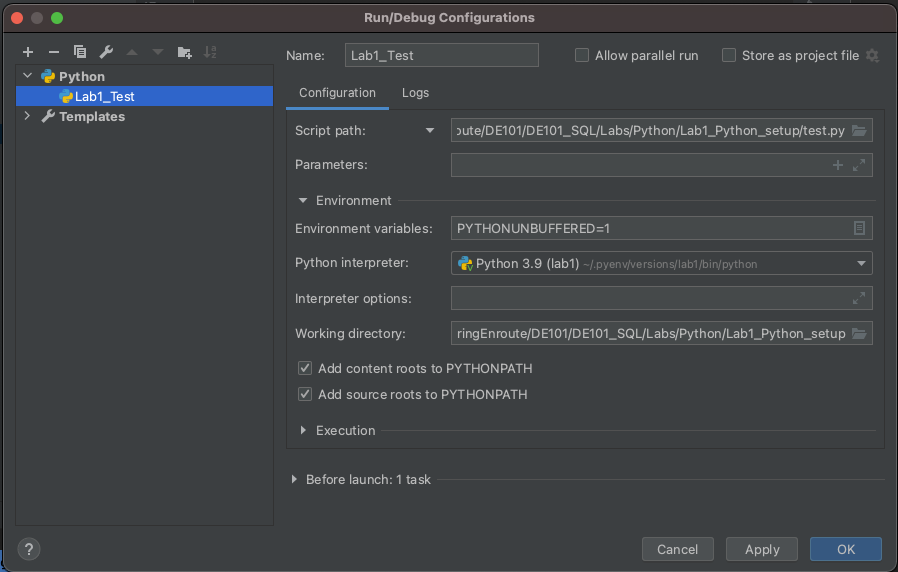

# Python Lab1: Environment Setup 

# Virtual environments

Python virtual environments create isolated contexts to keep dependencies required by different projects separate so 
they don't interfere with other projects or system-wide packages. 
Basically, setting up virtual environments is the best way to isolate different Python projects, especially if these 
projects have different and conflicting dependencies.

> Tip: Always set up a separate virtual environment for each Python project, and install all the required dependencies 
> inside it, never install packages globally.

## Install pyenv

Follow the provided tutorials depending your OS to install **pyenv** in your machine:

* Window: https://github.com/pyenv-win/pyenv-win
* Mac/Linux: https://realpython.com/intro-to-pyenv/

> Don't forget to add pyenv to your path as showed in the tutorials

## Using pyenv to install python
There are multiple versions of python where you can choose from, for these series of labs we will use Python3.9, let's install it: 

```
pyenv install 3.9.0
```

## Creating the virtual environment

To create a virtual environment use the following command:

* `<python_version>` is optional, but it is useful to make sure you are creating the virtual environment with the version that you want
* `<environment_name>` is just the name of the environment that will help you keep your environments separate

```
$ pyenv virtualenv <python_version> <environment_name>
```

Example: 

```
$ pyenv virtualenv 3.9.0 lab1
```

## Activate the virtual environment

Now that the environment is created, you need to activate it:  

```
$ pyenv local lab1
```

> Tip: When the virtual environment is activated you can see the name at the beginning of the command line
> i.e. (lab1) ~/DE101_SQL/Labs/Python/Lab1_Python_setup 

## Deactivate the virtual environment 

```
pyenv deactivate
```

# Jupyter Notebooks

JupyterLab is a web-based interactive development environment for notebooks, code, and data. It integrates code and its 
output into a single document where you can run code, display the output, add explanations, formulas, and charts to make your work more
transparent, understandable, repeatable and shareable. 

We will use a Docker container to run Jupyter notebooks throughout the Python for Data Engineering course. 
 
The following command pulls the `jupyter/datascience-notebook` image from Docker Hub if it is not already present 
on the local host. It then starts a container running a Jupyter Server and exposes the server on port `8888` of the host machine.

```
$ cd Labs/Python
$ docker run -it --rm --name jupyternotebook -p 8888:8888 -v "${PWD}/notebooks":/home/jovyan  jupyter/datascience-notebook
```

The use of the `-v` flag in the command mounts the current working directory on the host (`${PWD}/notebooks` in the example command) 
as `/home/jovyan` in the container. The server logs appear in the terminal.

Visiting `http://<hostname>:8888/?token=<token>` in a browser loads JupyterLab, where:

* `hostname` is the name of the computer running Docker
* `token` is the secret token printed in the console.

Due to the usage of the flag `--rm` Docker automatically cleans up the container and removes the file system when the 
container exits, but all the files in the container will remain intact on the host.

## Create a new notebook

To create a new notebook click on the plus sign, the **Launcher** will open, then select **Python 3 (ipykernel)**:



Print and run `Hello World`, then save the file: 



You will be able to see the notebook in your machine under `Lab1_Python_setup/notebooks` folder. 

# Pycharm

PyCharm is a super popular Python IDE, you are welcome to use it throughout these labs, to run your scripts using virtual 
environments you can follow the installation below. 

In this folder there is a python script [test.py](test.py), we will setup our environment with Pycharm so we can run it
directly from there. 

Download [Pycharm](https://www.jetbrains.com/es-es/pycharm/) Community edition. 

## Setting up the interpreter  
A virtual environment consist of a base interpreter and installed packages, now we have to add the python interpreter 
that we setup in previous steps in Pycharm in order to run our `test.py` file with it.

Go to **PyCharm** > **Preferences** > **Python Interpreter** > **Add**:



Select the **Existing environment** and look for the `lab1` virtual environment: 



## Add Configuration 

In order to run our script we need to add a configuration, go to the top right corner to **Add Configuration...** > **+** > **Python**: 



Fill the information for the script path, working directory and make sure you are using the python interpreter that we just 
set up in the previous step:  



Save your changes and now execute the script using the green arrow on the top right corner:


Example output: 

```
/Users/dpatron/.pyenv/versions/lab1/bin/python /Users/dpatron/Documents/DataEngineeringEnroute/DE101/DE101_SQL/Labs/Python/Lab1_Python_setup/test.py
Hello World from python version 3.9.0 (default, Oct  6 2022, 00:08:15) 
[Clang 12.0.5 (clang-1205.0.22.11)]

Process finished with exit code 0
```


# Command Line

You can always run your scripts from the command line with the python command: 

```
python <path_to_script>
```

Example:
```
$ python test.py 
Hello World from python version 3.9.0 (default, Oct  6 2022, 00:08:15) 
[Clang 12.0.5 (clang-1205.0.22.11)]
```